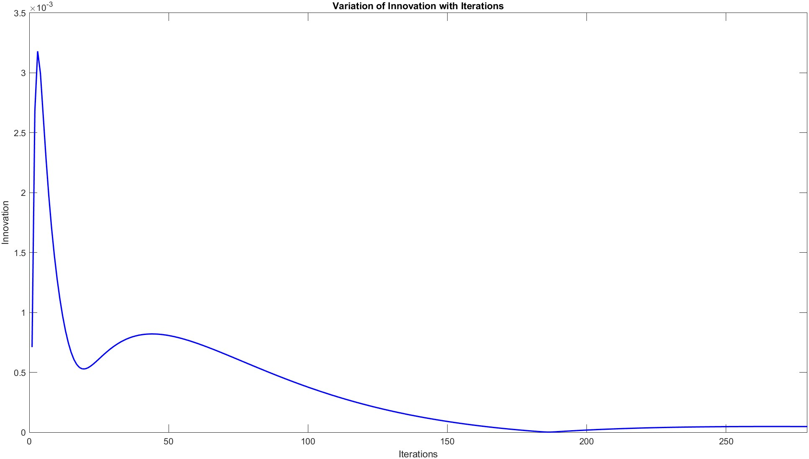

<body>

<h1>Quadruple Tank Problem</h1>

This project involves using estimation techniques to control the setup of a quadruple tank process to a desired set point.

<h2>System Description</h2>

The quadruple tank process is described in the paper titled "The quadruple-tank process: a multivariable laboratory process with an adjustable zero" by K. H. Johansson [1]. The system consists of four interconnected tanks as shown below:

<!-- Include the image for tank.jpg -->
[1]

Using first principle method we describe the system as per the equations

[1]

The additional data given in the paper [1] is shown below

[1]
<h2>State Space Representation</h2>

The state space representation of the system is provided in the paper [1]. The parameters A, B, and C are described in the images below:

<!-- Display images side by side -->

  <!-- Include the image for A.jpg -->
  

    
    
[1]

  

  <!-- Include the image for B.jpg -->
  

    
    
 [1]

  

<!-- Include the image for C.jpg -->
[1]

Additionally, the temperature parameters Ti are shown in the image below:

<!-- Include the image for Ti.jpg -->
[1]

<h2>Measurements Generation</h2>
 
<em>(refer to  file Data_Generation)</em>

    
This code simulates a system of four interconnected tanks (as shown in the image above) and generates data representing the measurements available from the sensors placed in each tank. Here's a brief description of the system and data generation process:

    <ul>
        <li><h3>System Description</h3><ul>
                <li>The system consists of four tanks interconnected with pipes.</li>
                <li>Each tank has an input flow rate and is subjected to gravitational forces.</li>
                <li>The height of the liquid in each tank varies over time due to inflow and outflow dynamics as shown earlier.</li>
            </ul>
        </li>
        <li><h3>Data Generation</h3>
            <ul>
                <li>The differential equations governing the dynamics of the system are defined based on the principles of fluid dynamics and mass balance.</li>
                <li>The system of differential equations is numerically solved using the <code>odeint</code> function from the <code>scipy.integrate</code> module.</li>
                <li>The simulation is conducted over a specified time range (0 to 10000 seconds) with 10000 time points.</li>
                <li>The resulting time series data includes the heights of liquid in each tank (<code>Height_1</code> to <code>Height_4</code>) at each time point.</li>
                <li>This data represents the measurements available from the sensors placed in each tank, providing insights into the dynamics of the system over time.</li>
            </ul>
        </li>
        <li><h3>Data Export</h3>
            <ul>
                <li>The generated data is stored in a pandas DataFrame.</li>
                <li>The DataFrame is exported to an Excel file named "tank_data.xlsx" for further analysis or visualization.</li>
            </ul>
        </li>
</ul>
<h2>Methods</h2>

<h3>Part 1: Kalman Filter</h3>

<em>(refer to  file Kalman_Filter)</em>

In this part, the Kalman Filter was applied to estimate states and analyze the residuals.The following algorithm was executed : - 

[2]

Now on simulating the filter we observe that the readings converge to a final point . First looking at variation of x_prior followed by variation of x_posterior 

The covariance matrix P thus reduces in value thus showing higher accuracy in estimation , the Kalman gain as well reduces to zero.

Thus we check the accuracy of our predictions by checking the residuals and innovations which tend to zero as we see below

<h4>Conclusion</h4>

        The simulation of the Kalman Filter demonstrates a successful estimation of states with convergence towards accurate values. Key observations from the simulation results include:
    

    <ul>
        <li>
            <strong>State Estimation Convergence:</strong>
            The graphs of <i>xprior</i> and <i>xposterior</i> illustrate that the state estimates converge to a final point. This indicates that the filter effectively tracks the true state over time.
        </li>
        <li>
            <strong>Covariance Matrix Reduction:</strong>
            The reduction in the values of the covariance matrix <i>P</i> signifies an increase in estimation accuracy. As the filter processes more measurements, it becomes more confident in its state estimates, leading to a decrease in uncertainty.
        </li>
        <li>
            <strong>Kalman Gain Reduction:</strong>
            The Kalman gain reduces to zero, which is expected as the filter converges. A lower Kalman gain implies that new measurements have less impact on the state estimates, indicating a high level of confidence in the current state estimate.
        </li>
        <li>
            <strong>Residuals and Innovations:</strong>
            The residuals and innovations approach zero, confirming the accuracy of the predictions. This behavior suggests that the filter's estimates align closely with the actual measurements, validating the effectiveness of the Kalman Filter in minimizing prediction errors.
        </li>
    </ul>
    

        Overall, the simulation results confirm the Kalman Filter's capability to accurately estimate states by reducing uncertainty and refining predictions over time. The convergence of state estimates, reduction in covariance values, diminishing Kalman gain, and minimal residuals collectively demonstrate the filter's proficiency in state estimation tasks.
    

<h3>Part 2: Particle Filter</h3>

<em>(refer to  file Particle_Filter)</em>

In this part, we apply the Particle Filter to achieve visible convergence. Due to limited computational power, running the Particle Filter with a large number of particles may be challenging. Therefore, we perform simulations using different numbers of particles to observe the impact on state estimation accuracy.

Simulating with 10 particles, we observe the following results:

When we increase the number of particles to 50, we achieve significantly better state estimation:

<h4>Conclusion</h4>

    The simulations demonstrate that increasing the number of particles in the Particle Filter enhances state estimation accuracy. With 10 particles, the state estimation is less precise, while increasing to 50 particles yields a more accurate and reliable estimate. This improvement highlights the importance of the number of particles in achieving better performance in Particle Filter implementations.

<h3>Part 3: Extended Kalman Filter with Model Predictive Control</h3>

<em>(refer to  file EKF_MPC)</em>

In this part, we will apply the Extended Kalman Filter (EKF) to estimate the state and use Model Predictive Control (MPC) to take the system to the desired set point.

Thus  in order to solve the system using EKF by linearizing at 10 points , we thus linearize at instants 0,9,19,29,39,49,59,69,79,89.

<em>(Due to some run time issues instead of
using one main for loop , the code was divided into 9 for loops at each linearizing instant)</em>

On simulating we get the similar results as KF like the innovations and residuals vary as 

<h4>Implementing MPC without MATLAB Toolbox</h4>

Controlled Variables are h1, h2 when all states are measured for a set-point for [h1 h2] of [13.4 13.7].

The general implementation of MPC is as follows:

[3]

The process starts with defining the MPC function to find the augmented matrices for the system and various other functions such as Phi, F, R, etc. Also, Phi here is the Toeplitz matrix. <em>(refer to the file mpcgain.m)</em>

Then, we define the system parameters of the 4-tank system in the discretized format, followed by the prediction and control horizons being defined along with the MPC function being called upon.

The steps involved are:

<ul>
  <li>Define the MPC function to find the augmented matrices for the system and other necessary functions (e.g., Phi, F, R).</li>
  <li>Phi is the Toeplitz matrix (refer to the file mpcgain.m).</li>
  <li>Define the system parameters of the 4-tank system in the discretized format.</li>
  <li>Define the prediction and control horizons.</li>
  <li>Call the MPC function.</li>
  <li>Implement the minimization of the cost function.</li>
  <li>Estimate the new state with dU.</li>
</ul>

The input and output plots are as follows:

The stability was decided using eigenvalues of (A - BKMPC); the eigenvalues were found to be inside the unit circle, hence a stable system.<em>(refer to the file mpc_sim.m)</em>

<h4>Implementing MPC using MATLAB Toolbox</h4>

<em>(refer to the file mpc_toolbox.m)</em>

In this implementation, we use the inbuilt MATLAB toolbox for MPC along with constraints on the system being defined as:

Upon simulation, we obtain the following results:

Conclusion: The implementation of MPC, both manually and using the MATLAB toolbox, demonstrates the robustness and effectiveness of model predictive control in managing complex control systems. While the manual approach allows for deeper understanding and customization, the MATLAB toolbox provides a streamlined and efficient way to incorporate constraints and achieve optimized control outputs. The results from both methods confirm the stability and reliability of MPC in achieving desired control objectives.

<h2>References</h2>

<ol>
  <li>K. H. Johansson, "The quadruple-tank process: a multivariable laboratory process with an adjustable zero," in IEEE Transactions on Control Systems Technology, vol. 8, no. 3, pp. 456-465, May 2000, <a href="https://doi.org/10.1109/87.845876">doi: 10.1109/87.845876</a>.</li>
  <li>“Kalman filter.” https://ece.montana.edu/seniordesign/archive/SP14/UnderwaterNavigation/kalman_filter.html</li>
  <li>“What is Model Predictive Control?
- MATLAB & Simulink
- MathWorks India.” https://in.mathworks.com/help/mpc/gs/what-is-mpc.html</li>
</ol>

</body>

