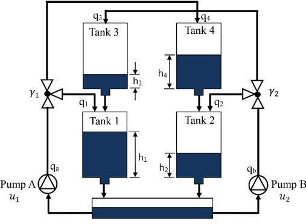

<body>

<h1>Quadruple Tank Problem</h1>

This project involves using estimation techniques to control the setup of a quadruple tank process to a desired set point.

<h2>System Description</h2>

The quadruple tank process is described in the paper titled "The quadruple-tank process: a multivariable laboratory process with an adjustable zero" by K. H. Johansson [1]. The system consists of four interconnected tanks as shown below:

<!-- Include the image for tank.jpg -->
[1]

Using first principle method we describe the system as per the equations

[1]

The additional data given in the paper [1] is shown below

[1]
<h2>State Space Representation</h2>

The state space representation of the system is provided in the paper [1]. The parameters A, B, and C are described in the images below:

<!-- Display images side by side -->

  <!-- Include the image for A.jpg -->
  

    
    
[1]

  

  <!-- Include the image for B.jpg -->
  

    
    
 [1]

  

<!-- Include the image for C.jpg -->
[1]

Additionally, the temperature parameters Ti are shown in the image below:

<!-- Include the image for Ti.jpg -->
[1]

<h2>Measurements Generation</h2>
 
<em>(refer to  file Data_Generation)</em>

    
This code simulates a system of four interconnected tanks (as shown in the image above) and generates data representing the measurements available from the sensors placed in each tank. Here's a brief description of the system and data generation process:

    <ul>
        <li><h3>System Description</h3><ul>
                <li>The system consists of four tanks interconnected with pipes.</li>
                <li>Each tank has an input flow rate and is subjected to gravitational forces.</li>
                <li>The height of the liquid in each tank varies over time due to inflow and outflow dynamics as shown earlier.</li>
            </ul>
        </li>
        <li><h3>Data Generation</h3>
            <ul>
                <li>The differential equations governing the dynamics of the system are defined based on the principles of fluid dynamics and mass balance.</li>
                <li>The system of differential equations is numerically solved using the <code>odeint</code> function from the <code>scipy.integrate</code> module.</li>
                <li>The simulation is conducted over a specified time range (0 to 10000 seconds) with 10000 time points.</li>
                <li>The resulting time series data includes the heights of liquid in each tank (<code>Height_1</code> to <code>Height_4</code>) at each time point.</li>
                <li>This data represents the measurements available from the sensors placed in each tank, providing insights into the dynamics of the system over time.</li>
            </ul>
        </li>
        <li><h3>Data Export</h3>
            <ul>
                <li>The generated data is stored in a pandas DataFrame.</li>
                <li>The DataFrame is exported to an Excel file named "tank_data.xlsx" for further analysis or visualization.</li>
            </ul>
        </li>
</ul>
<h2>Methods</h2>

<h3>Part 1: Kalman Filter</h3>

In this part, we will apply the Kalman Filter to estimate states and analyze the residuals.

<h3>Part 2: Particle Filter</h3>

In this part, we will apply the Particle Filter to obtain visible convergence. Due to limited computational power, running the Particle Filter may be difficult.

<h3>Part 3: Extended Kalman Filter with Model Predictive Control</h3>

In this part, we will apply the Extended Kalman Filter to estimate the state and use Model Predictive Control to take the system to the desired set point.

<h2>References</h2>

<ol>
  <li>K. H. Johansson, "The quadruple-tank process: a multivariable laboratory process with an adjustable zero," in IEEE Transactions on Control Systems Technology, vol. 8, no. 3, pp. 456-465, May 2000, <a href="https://doi.org/10.1109/87.845876">doi: 10.1109/87.845876</a>.</li>
</ol>

</body>

